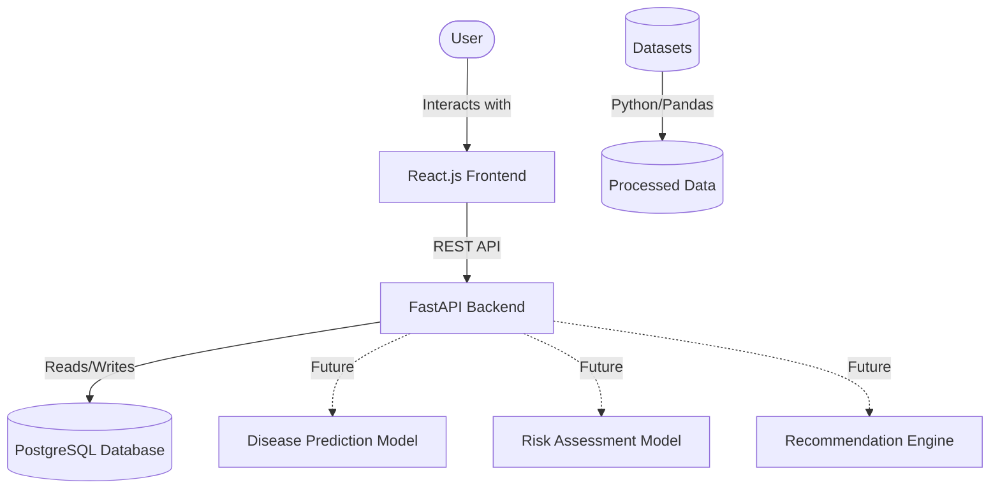

# MedAssist AI Architecture

Below is the simplified architecture for Week 1.

```mermaid
flowchart TD
    User([User]) --> |Interacts with| Frontend[React.js Frontend]
    
    Frontend --> |REST API| Backend[FastAPI Backend]
    
    Backend --> |Reads/Writes| Database[(PostgreSQL Database)]
    
    Datasets[(Datasets)] --> |Python/Pandas| ProcessedData[(Processed Data)]
    
    %% Future ML Components (Not implemented in Week 1)
    Backend -.-> |Future| DiseaseModel[Disease Prediction Model]
    Backend -.-> |Future| RiskModel[Risk Assessment Model]
    Backend -.-> |Future| RecEngine[Recommendation Engine]
```
