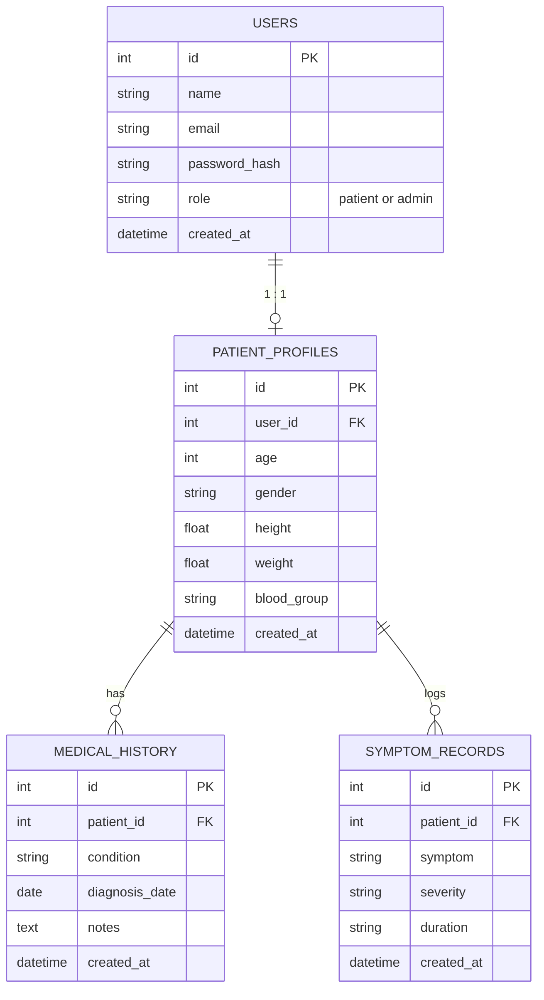

# MedAssist AI Database Schema

Below is the database design for Week 1.

```mermaid
erDiagram
    USERS ||--o| PATIENT_PROFILES : "1 : 1"
    PATIENT_PROFILES ||--o{ MEDICAL_HISTORY : "has"
    PATIENT_PROFILES ||--o{ SYMPTOM_RECORDS : "logs"

    USERS {
        int id PK
        string name
        string email
        string password_hash
        string role "patient or admin"
        datetime created_at
    }

    PATIENT_PROFILES {
        int id PK
        int user_id FK
        int age
        string gender
        float height
        float weight
        string blood_group
        datetime created_at
    }

    MEDICAL_HISTORY {
        int id PK
        int patient_id FK
        string condition
        date diagnosis_date
        text notes
        datetime created_at
    }

    SYMPTOM_RECORDS {
        int id PK
        int patient_id FK
        string symptom
        string severity
        string duration
        datetime created_at
    }
```
